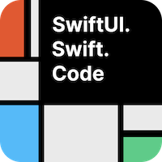

## SwiftTutorial

 

-----

This is SwiftUI Tutorial
Already have content is below

* Text
* Shape
* Color
* Gradient
* Icons & Image
* Frame
* Background & overlay
* Stack(ZStack, VStack, HStack)
* Padding
* Spacer
* Init & Enum
* foreach & scrollView
* LazyGrid
* SafeArea
* Button
* StateAndBinding
* Animation
* Animation curves
* Transition
* Sheet
* NavigationView & NavigationLink
* List
* Alert
* confirmationDialog (原 ActionSheets)
* ContextMenu
* TextEditor
* Toggle
* Picker
* ColorPicker
* DatePicker
* Stepper
* Slider
* TabView
* DarkMode
* Appear
* Gesture
* ObservableObject & StateObject
* EnvrinomentObject
* AppStorage
* AppStorageSample
* AsyncImage
* Materials
* TextSelect
* ButtonStyle
* ListSwiperAction
* FocusState
* NavigationStack
--------------

公众号：RobotPBQ

----

Blog site

[medium](https://medium.com/@karepbq)

[掘金](https://juejin.cn/user/694547078978184/posts)

